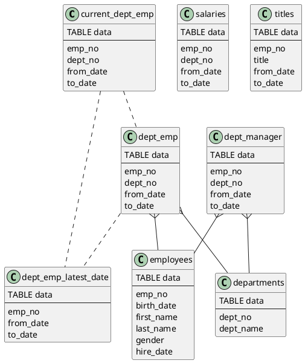

---
{"author":"aming","email":"jikcheng@163.com","title":"Generate datacharmer Data","creation_date":"2022-06-27 15:57","Last modified date":"2022-11-27 19:08","tags":"Generate datacharmer Data","File Folder with relative path":"database/MySQL/Doc/MySQL Tutorial","remark":null,"other":null,"dg-publish":true,"permalink":"/database/my-sql/doc/my-sql-tutorial/generate-datacharmer-data/","dgPassFrontmatter":true}
---


# 1. 测试数据导入
## 1.1. 下载MySQL开源测试数据
```console
git clone https://github.com/datacharmer/test_db.git
```
## 1.2. 进入目录
## 1.3. 导入数据
- 超大的分区表
```sh
mysql -u root -p1234 < employees_partitioned.sql`
```

- 导入普通表
```sql
mysql < employees.sql
```
## 1.4. 测试是否成功导入

```console
[root@dbserver test_db]# mysql -u root -p1234  -t < test_employees_sha.sql
mysql: [Warning] Using a password on the command line interface can be insecure.
+----------------------+
| INFO                 |
+----------------------+
| TESTING INSTALLATION |
+----------------------+
+--------------+------------------+------------------------------------------+
| table_name   | expected_records | expected_crc                             |
+--------------+------------------+------------------------------------------+
| employees    |           300024 | 4d4aa689914d8fd41db7e45c2168e7dcb9697359 |
| departments  |                9 | 4b315afa0e35ca6649df897b958345bcb3d2b764 |
| dept_manager |               24 | 9687a7d6f93ca8847388a42a6d8d93982a841c6c |
| dept_emp     |           331603 | d95ab9fe07df0865f592574b3b33b9c741d9fd1b |
| titles       |           443308 | d12d5f746b88f07e69b9e36675b6067abb01b60e |
| salaries     |          2844047 | b5a1785c27d75e33a4173aaa22ccf41ebd7d4a9f |
+--------------+------------------+------------------------------------------+

+--------------+------------------+------------------------------------------+
| table_name   | found_records    | found_crc                                |
+--------------+------------------+------------------------------------------+
| employees    |           300024 | 4d4aa689914d8fd41db7e45c2168e7dcb9697359 |
| departments  |                9 | 4b315afa0e35ca6649df897b958345bcb3d2b764 |
| dept_manager |               24 | 9687a7d6f93ca8847388a42a6d8d93982a841c6c |
| dept_emp     |           331603 | d95ab9fe07df0865f592574b3b33b9c741d9fd1b |
| titles       |           443308 | d12d5f746b88f07e69b9e36675b6067abb01b60e |
| salaries     |          2844047 | b5a1785c27d75e33a4173aaa22ccf41ebd7d4a9f |
+--------------+------------------+------------------------------------------+
+--------------+---------------+-----------+
| table_name   | records_match | crc_match |
+--------------+---------------+-----------+
| employees    | OK            | ok        |
| departments  | OK            | ok        |
| dept_manager | OK            | ok        |
| dept_emp     | OK            | ok        |
| titles       | OK            | ok        |
| salaries     | OK            | ok        |
+--------------+---------------+-----------+
+------------------+
| computation_time |
+------------------+
| 00:01:21         |
+------------------+
+---------+--------+
| summary | result |
+---------+--------+
| CRC     | OK     |
| count   | OK     |
+---------+--------+
```

## 1.5. 导入的模型关系图

